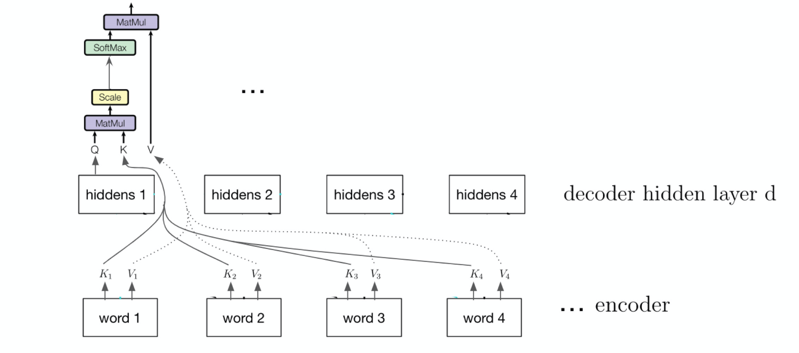

# Deep Learning Speech-to-Text Generation with Attention

This is my code for the Kaggle Competition for the CMU-11785 Introduction to Deep Learning, where I ranked 14/278 (Top 5%). The competition details can be found in [kaggle](https://www.kaggle.com/c/11-785-s20-hw4p2). This is the end-to-end **character-based** network using a combination of Recurrent Neural Networks (RNNs) / Convolutional Neural Networks (CNNs) and Dense Networks for speech to text transcription. It can transcribe a given speech utterance to its corresponding transcript

## Data

The data can be downloaded at [data](https://www.kaggle.com/c/11-785-s20-hw4p2/data), which is WSJ dataset.

The data is the mel-spectrograms that have 40 band frequencies for each time step of the speech data, whose dimensions are [frames, time step, 40]. The labels are the transcripts, which are arranged in the same order as the utterances.

## Architecture

This character-based model is developed based on the [Listen, Attend and Spell](https://arxiv.org/pdf/1508.01211.pdf) paper.

The **Listener** consists of a Pyramidal Bi-LSTM Network structure that takes in the given utterances and compresses it to produce high-level representations for the Speller network. The Listener has one Bi-LSTM layer and three pBLSTM layers, and each layer has 256 hidden units. The Locked Dropout with dropout probability 0.5 is applied between each LSTM layer.

The **attention** here is the reimplementation of the Scaled Dot-Product attention. The size of key and value are both 128. In the **Speller**, two LSTM Cell of 512 hidden units are used and one Attention layer is applied before each LSTM Cell to generate the weighted context. The Locked Dropout with dropout probability 0.5 is applied between the Attention and the LSTM Cell.

One linear layer with 256 filters are used after the Speller, which is followed by a HardTanh activation function. The output linear layer has 34 filters to generate the output probability matrix, which corresponds to the total vocabulary size.

The attention architecture shows as the following:

 

## Experiments

The Adam optimizer with default learning rate of 0.001 without weight decay is applied. The ReduceLROnPlateau with factor of 0.5 is used as the learning rate scheduler. The training is finished at 50 epochs with a teacher forcing 0.8, which is 20% probability using the prediction result while 80% probability using the ground truth in the Speller to predict the next output.

Then the best model is fine-tuned with teacher forcing ratio 0.6 for another 50 epochs. The optimizer, learning rate, and schedule for the fine-tuning are the same as the setting for the training.

At the end, the beam search with a beam width 10 is applied to decode the generated output probability.
